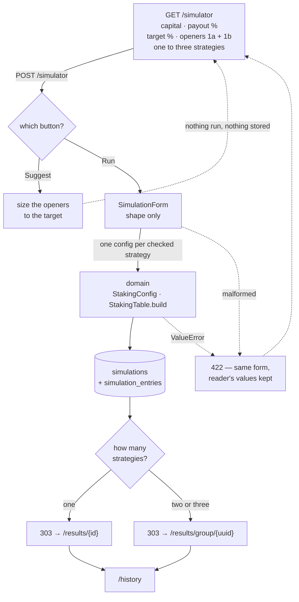
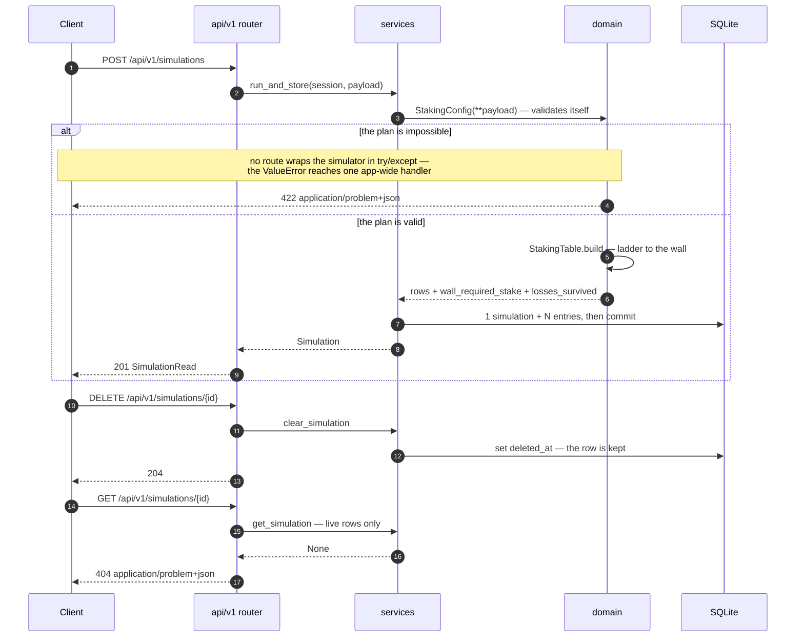

# Martingale Wall Simulator

A web app that answers one question honestly:

> If I follow this staking plan and keep losing, how far can I go before my account can no longer
> cover the next required stake?

That breaking point is the **martingale wall**, and finding it is the entire purpose of this tool.

## What this is, and what it is not

On a binary-option-style trade paying less than 100%, a winning trade returns only a fraction of
what was staked. So recovering a losing streak requires staking *more* than the streak cost — and
the amount needed grows faster than the streak itself. No staking pattern escapes this. Not flat,
not Fibonacci, not doubling, not a debt-driven recovery formula.

The useful question is therefore not *"which pattern recovers losses"* — several do, on paper —
but *"how many consecutive losses can my capital actually absorb before the required stake exceeds
what's left."*

This simulator answers that, and only that. It is deterministic: it assumes **every entry loses**
and reports where the account breaks. It does not model win probability, it does not predict
markets, and it is not a strategy that beats a negative-expectancy game. It is an instrument for
seeing exactly how and where such a strategy fails.

## The staking plan being modelled

1. **Entry 1a** and **1b** — two entries placed by hand on the first candle. They are the only
   numbers supplied directly; everything after them is derived.
2. **From entry 2 on**, the stake is computed from accumulated debt by one of three named
   strategies:

   | Strategy | Rule | What it is reaching for |
   |---|---|---|
   | `adder_breakeven` | `⌈cumulative_loss ÷ payout_ratio⌉` | the smallest whole-dollar stake that, winning, gets back to even |
   | `adder_profit` | `⌈(cumulative_loss + target_profit) ÷ payout_ratio⌉` | the same, plus a fixed profit on top — identical to breakeven when the target is 0 |
   | `double` | `2 × cumulative_loss` | the textbook martingale; the only one that reads neither the payout nor the target |

The simulation stops the instant the next required stake exceeds the remaining balance.

Reference case — $1,000 of capital, $5 + $5 on the first candle, a 92% payout and no target profit:

| Strategy | Entries placed | Next stake needed | Balance left |
|---|---|---|---|
| `adder_breakeven`, `adder_profit` | 8 | **$910** | **$163** |
| `double` | 6 | **$1,620** | **$190** |

Doubling reaches the wall two entries sooner. Neither escapes it.

## Pages

| Path | What it does |
|---|---|
| `/` | The theory — how the payout mechanic works, why recovery staking hits a wall, and a FAQ for reading the results table |
| `/simulator` | Capital, payout %, a target profit (as % of capital), the two opening entries, and a choice of strategies to compare — only the entry cap sits under **Advanced** |
| `/results/{id}` | One strategy's ladder, entry by entry, to the wall |
| `/results/group/{uuid}` | Several strategies compared side by side, one table each, from a single submission |
| `/history` | Past runs, revisitable and clearable |

## How a run gets made

One form submission, one strategy per checked box, one stored run each. The domain does the
arithmetic and knows nothing about HTTP; the page layer does the rendering and knows nothing about
the arithmetic.



Four things in that path are deliberate:

- **The domain does the arithmetic and nothing else.** `StakingConfig` validates itself, and
  `StakingTable.build` walks the ladder row by row — each stake is `ceil`'d off the previous one,
  which is exactly why it cannot be vectorised.
- **Percentages stop at the edge.** The form takes a payout percentage and a target profit as a
  percentage of capital; both are converted before the domain sees them, so the simulator only ever
  handles a ratio and an absolute amount.
- **Every config is built before any row is written**, so a plan rejected part-way leaves nothing
  half-saved. Two or three strategies get a shared `run_group`; a single one is stored exactly as a
  lone run always was.
- **Submitting redirects.** `303` means the result page is reached by a fresh `GET`, so reloading it
  re-reads a stored run instead of re-submitting the form. Clearing anything from `/history` sets
  `deleted_at` — it never drops a row.

Both rejection paths land back on the same form with the reader's own values still in the inputs and
the message beside the offending field. The rules are not restated to get there: `SimulationForm`
checks shape, the domain checks the plan.

## The JSON API

`/api/v1` is the versioned contract; the pages above are not versioned, because their only consumer
is the browser being served and their addresses are things people bookmark. The version prefix is
declared once, in `api/v1/__init__.py`, and never inside a route.

| Endpoint | Body in | Out |
|---|---|---|
| `GET /api/v1/health` | — | `200` · `{status, app}` |
| `POST /api/v1/simulations` | `SimulationCreate` — one strategy, absolute dollars | `201` · `SimulationRead` (inputs, verdict, full ladder) |
| `GET /api/v1/simulations` | — | `200` · `SimulationSummary[]`, newest first |
| `GET /api/v1/simulations/{id}` | — | `200` · `SimulationRead`, or `404` |
| `DELETE /api/v1/simulations/{id}` | — | `204` · soft-deleted, or `404` |

Every field of `SimulationCreate` is optional and defaults to `StakingConfig`'s own, so a body need
only carry what it changes. Two things differ from the form: the API takes a **payout ratio and an
absolute target profit**, not percentages, and it submits **one strategy per request** — so
`run_group` is always null on a run made this way.



Every 4xx is an RFC 9457 problem detail, served as `application/problem+json`. There is exactly one
place a domain rejection becomes an HTTP status — the handler registered in `main.py` — so no route
re-implements the plan's rules or catches `ValueError` on its own.

**A note on the one v1 contract break so far.** Dropping the hand-supplied second entry (above)
removed `second_entry` from `SimulationSummary`, the v1 response shape, without cutting a v2. That
is normally what forces a new API version; it was done anyway because the API had no external
consumers yet, and a second router set was not worth maintaining over a prototype contract. The
database column was kept, made nullable, and stopped being written — so runs recorded before this
change keep their stored value even though no response exposes it any more.

## Running in development

Two supported paths. Both do everything; pick whichever you prefer.

**Every command below runs from the repository root** — the directory holding `pyproject.toml`.
Two settings are resolved relative to the working directory, not to the package: the `.env` file,
and the `sqlite:///./app.db` path inside it. Run the server from anywhere else and both miss.
SQLite creates an empty file rather than reporting a missing one, so the app starts cleanly,
connects to a database with no tables, and every page that reads history fails with
`no such table: simulations` while `app.db` sits intact in the repository root.

`uv run` normally makes that impossible — from the wrong directory it finds no project and exits
with `ModuleNotFoundError: No module named 'app'`. It only becomes silent if the virtualenv has
been activated by hand, which lets the import resolve from anywhere. That is the practical reason
for the rule below: **never activate the venv**; prefix with `uv run` instead.

### With uv

Requires [uv](https://docs.astral.sh/uv/). Python is managed for you.

```bash
uv sync                                  # create the venv from the lockfile
cp .env.example .env                     # local settings
uv run alembic upgrade head              # create the SQLite schema
uv run uvicorn app.main:app --reload     # http://127.0.0.1:8000
```

### With Docker

```bash
cp .env.example .env
docker compose up api                    # http://127.0.0.1:8000
```

The dev service bind-mounts the source, so edits reload without a rebuild. Rebuild only after a
dependency change:

```bash
docker compose build api
```

### Common commands

| Task | uv | Docker |
|---|---|---|
| Run tests | `uv run pytest` | `docker compose run --rm api pytest` |
| One test | `uv run pytest -k wall` | `docker compose run --rm api pytest -k wall` |
| Lint | `uv run ruff check .` | `docker compose run --rm api ruff check .` |
| Format | `uv run ruff format .` | `docker compose run --rm api ruff format .` |
| Typecheck | `uv run mypy src` | `docker compose run --rm api mypy src` |
| New migration | `uv run alembic revision --autogenerate -m "..."` | same, on the host |

Dependencies are always added on the host with `uv add`, never inside a container — a
container-local install dies with the container and never reaches the lockfile.

## Storage

SQLite, for the prototype. Rows are **soft-deleted**: clearing the history sets a `deleted_at`
timestamp rather than dropping data, so a cleared table can still be inspected.

Production moves to PostgreSQL or MySQL. The schema is written to be portable and the move is a
`DATABASE_URL` change plus `alembic upgrade head` — the same migrations build the schema on any of
the three engines.

## Layout

```
src/app/
  domain/      the simulator — pure Python, no dependencies, no framework
  models/      SQLAlchemy ORM
  schemas/     Pydantic request/response contracts
  services/    use cases
  api/v1/      JSON routers
  web/         HTML page routers
  templates/   Jinja2
  static/      hand-authored CSS
```

`domain/` is deliberately free of FastAPI, Pydantic, and SQLAlchemy. It runs under bare `python3`
with nothing installed, which keeps the simulation independently testable and reusable:

```bash
cd src && python3 -c "import app.domain.staking_simulator"
```

## Documentation

The design documents — the architecture write-up with its layer diagram, ERD and migration path,
and the detailed notes on the domain module — are kept in the surrounding workspace rather than in
this repository, which holds the implementation only.

## License

[BSD 3-Clause](LICENSE). Use it, modify it, redistribute it, commercially or not; keep the
copyright notice with any copy you pass on, and don't use the project's name to endorse whatever
you build from it.

The warranty disclaimer is worth reading in full given what this tool models. It reports the
arithmetic of a staking plan under a worst-case assumption. It is not financial advice, it makes no
claim about any strategy's profitability, and nothing in it is a warranty that trading on its
output will do anything but lose money.
